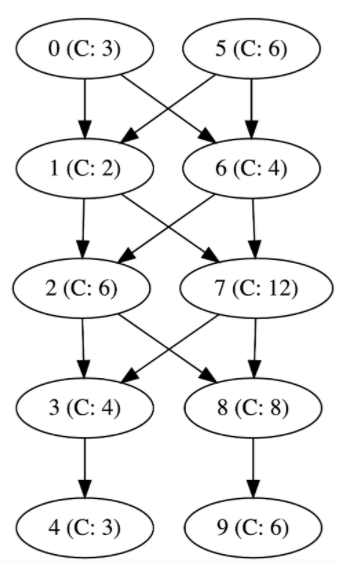

# Problem C3: CI Pipelines - Hard
*50 points*

## Problem
After some much needed upgrades to our infrastructure, servers are no longer confined to their pipelines! This means 
that one server can receive inputs from multiple other servers and can pass off its output to a range of servers yet 
again. We hope that this will remove bottlenecks from our system and speed up deployment.

Servers with multiple output destinations can choose which server to pass their results to. They are free to divide 
their output in any ratio among their downstream servers in order to maximize throughput.

Input format and constraint remain the [same](../../../../../src/xenoteo/com/github/pipelines/easy/README.md).

## Constraints
0 < *N* < 1500

## Sample
### Sample Input
```
10	N, the number of servers	
 
3	Server 0 has capacity 3
2	Server 1 has capacity 2
6	…
4	
3	
6	
4	
12	
8	
6	
	
0 1	Server 0 pushes to 1
0 6	Server 0 pushes to 6, too
1 2	
1 7	
2 3	
2 8	
3 4	
5 6	
5 1	
6 7	
6 2	
7 8	
7 3	
8 9	
```

### Sample Output
```
6
```

### Explanation of Sample
Server 5 can divide up its capacity and send 2 revisions to Server 1 and 4 revisions to Server 6. But now, the second 
stage (Server 1 and 6) are at full capacity and cannot process any more revision from Server 0. The remaining stages can
process more than 6 revisions so the second stage is the bottleneck which has a capacity of 6.

