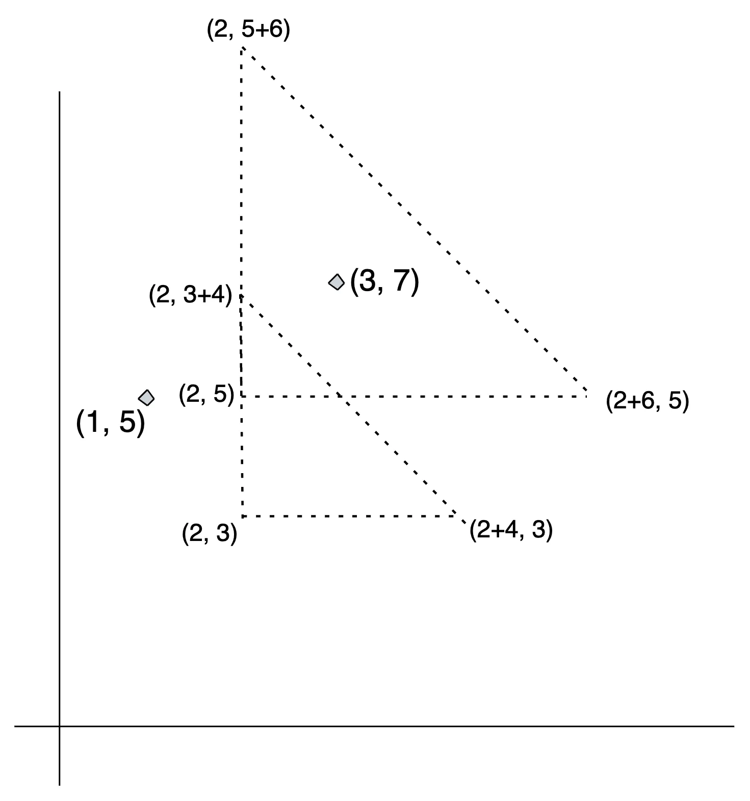

# Problem D3: Data Centers - Hard
*65 points*

## Problem
The Factory Builder of Hilarious Allocations and Calculated Kingdoms (**FB HACK**) has decided to build their Data
Centers on a particular piece of land with a special property; only Data Centers within a region defined by an axis-aligned
 right-angle isosceles triangle have network outages.

**FB HACK** is convinced this special property will ensure that their Data Centers are safe since they will be able to
easily predict how many of them will be affected when a particular network outage happens. Your task is to write a program
 that outputs **the number of Data Centers that will be affected by each network outage** given the position of data
 centers and a list of triangular regions that will have network outages.

## Input
The input will contain two integers *N* *Q* representing the number of Data Centers owned by FB HACK and the number
of possible network outages that can happen.

*N* lines will follow with two integers *X* *Y* representing the lattice points of the Data Centers.

*Q* lines will follow with three integers *x* *y* *d* representing the affected area by the network outage as the
 triangle *ABC* with vertices at *A(x+d,y)*, *B(x,y)*, *C(x,y+d)*.

Turns out all of the network outages in the world follow this unique behaviour! **FB HACK** is now getting hundreds of
thousands of requests to calculate the amount of sites that will be impacted by the triangular network outages.

Input format and output format remain the same. We now have larger constraints.

## Input Format
The input will contain two integers (*N* *Q*). *N* represents the number of Data Centers owned by FB HACK. *Q* represents
 the number of possible network outages that can happen.

## Constraints
1 ≤ *N* ≤ 4 ∗ 10<sup>5</sup>  
1 ≤ *Q* ≤ 4 ∗ 10<sup>5</sup>  
1 ≤ *X<sub>i</sub>*,*Y<sub>i</sub>* ≤ 3 ∗ 10<sup>5</sup>  
1 ≤ *x*, *y*, *d* ≤ 3 ∗ 10<sup>5</sup>  

## Output Format
For each of *Q* queries, output one integer on a new line which denotes the number of Data Centers that will be affected
 by the network outage happening in the triage with vertices *A(x+d,y)*, *B(x,y)*, *C(x,y+d)*.

## Sample
### Sample Input
```
2 2
1 5
3 7
2 5 6
2 3 4
```

### Sample Output
```
1
0
```

### Explanation of Sample
There are 2 Data Centers and 2 triangle network outages.
For the first outage trian(2, 5, 6), only the Data Center at (3, 7) is affected. So the output is 1.
For the second outage (2, 3, 4), no Data Center is affected. So the output is 0.


### Sample Input
```
2 3
5 5
3 7
2 6 3
2 6 4
2 2 1
```
### Sample Output
```
3
3
0
```

