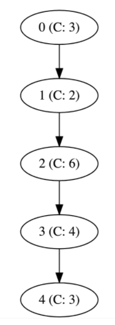

# Problem C1: CI Pipelines - Easy
*5 points*

## Problem
At Facebook, we have a system in place called “Continuous Push”. This means that we have 
a pipeline of servers that take revisions of our code, check them, build them, and then 
push them out into production 24/7. Each server has a capacity that tells us how many 
revisions an hour it will be able to process. We want to find out how often a version can 
be pushed into production in the ideal case.

Our Continuous Push process requires a series of **N** subsequent stages that perform 
specific actions on each revision of the code (build, test, etc). We have dedicated 
servers for each stage of the process, each one able to process **C** revisions over the
course of an hour. Each server then passes it on to another one in the pipeline that is
able to perform the action corresponding to the following stage.

Initially, we have one server dedicated to each stage of the process, labeled from **0** 
to **N-1**, arranged in one pipeline. Since we only have one pipeline, each server can 
receive input from exactly one source and will push its result to exactly one output. 
The two exceptions are the first and last servers in the pipeline, which won’t have an 
input and an output, respectively.

Given a list of servers with their capacities and inputs/output destinations, we’d like 
to know the throughput of our pipeline (how many revisions an hour make it to production) 
once the system is “hot”, i.e. at maximum capacity.

## Input Format
The first part of input will be the number of stages **N**.  
The second part is a list of the capacity of each server **C(0... N-1)**.  
Since there are **N** stages/servers, there will be N lines.  
The third part is a list of dependencies in the form of (**a** **b**), meaning
that Server **a** will pass its result onto Server **b**.  
The parts are separated by a new line.

## Constraints
0 < **N** < 100  
0 < **C** < 10000

## Sample
### Sample Input
<pre>
5	N, the number of servers
	
3	Server 0 has capacity 3
2	Server 1 has capacity 2
6	
4	
3	
	
0 1	Server 0 pushes results to 1
1 2	Server 1 pushes results to 2
2 3	
3 4	
</pre>

### Sample Output
<pre>
2
</pre>

### Explanation of Sample
Server 1 has capacity 2, so even if the other servers could do more work, everything 
downstream of Server 1 will need to wait for it to finish before being able to push the
revision along. Server 1 acts as a bottleneck, so our answer is 2.

