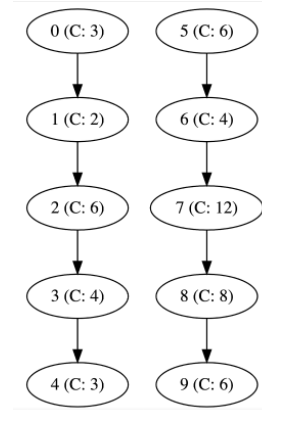

# Problem C2: CI Pipelines - Medium
*15 points*

## Problem
We’re constantly looking to improve the rate at which we can process these revisions. So, 
we are parallelizing our system! We still have **N** servers, each dedicated to one stage, 
but we now have multiple pipelines running at the same time. This means that multiple servers
can work on the same stage at the same time. Due to the way our network is structured, each
server can only pass their results on to one other server that is sitting in the same
pipeline.

Given a list of servers with their capacities and input/output destinations, calculate 
the capacity of all the available pipelines together!

Input format and constraints remain the [same](../easy/README.md).

## Constraints
0 < **N** < 1500

## Sample
### Sample Input
<pre>
10	N, the number of servers
 
3	Server 0 has capacity 3
2	Server 1 has capacity 2
6	…
4	
3	
6	
4	
12	
8	
6	
	
0 1	Server 0 pushes results to 1
1 2	Server 1 pushes results to 2
2 3	
3 4	
5 6	Note: Server 5 has no dependencies, it is the starting point of the second pipeline
6 7	
7 8	
8 9
</pre>

### Sample Output
<pre>
6
</pre>

### Explanation of Sample
There are two pipelines. Pipeline 1 (Sever 0 to Server 4) has throughput of 2. Pipeline 2
(Server 5 to Server 9) has throughput of 4. So, total capacity of all available pipelines
is 2+4 = 6.

