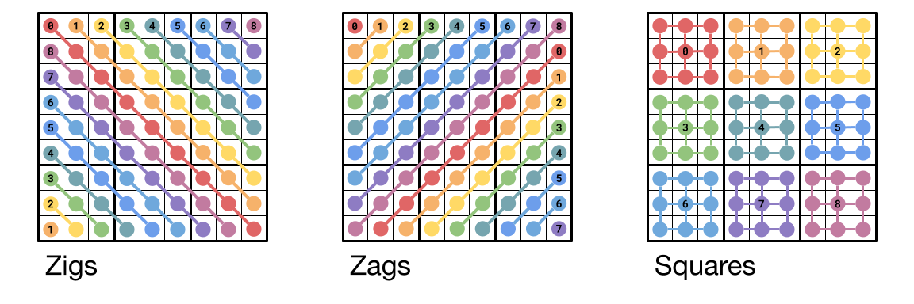

# Problem H1: ZigZag - Easy
*10 points*

## Problem
**ZigZag** is a logic-based, combinatorial number-placement puzzle, similar to Sudoku. 
The objective is to fill a 9x9 grid so that each zig, zag and square contain all the digits
from 0 to 8, inclusive, exactly once.

Zigs are diagonals, running from top left to bottom-right and wrapping around. Zags are 
diagonals, running from top-right to bottom-left (orthogonal to the zigs) and squares are 
3x3 sub-grids, similar to Sudoku.

The following diagrams indicate which Zigs, Zags and Squares each cell in a ZigZag belongs 
to.  In the Zigs diagram (left), all the cells in a Zig share a color and are connected
by lines to a cell with the Zig's numeric label. The Zags and Squares diagrams are organised
similarly:

Note that Zigs and Zags wrap around the grid, so each label appears twice in these diagrams.

Given a list of unfinished ZigZags, provide the sum of all numbers in the top three rows of
every grid, after the puzzles have been solved.

## Input
The input file format is as follows:
- The first line contains a single integer *N*, indicating the number of grids to follow.
- Each grid is printed with each of its rows on its own line.
- The "." character indicates an empty cell.
- Grids are separated from each other with an empty line.

## Output
Your output should be a file containing a single line with a number that's the sum of all
numbers in the top three rows of every grid, after the puzzles have been solved.

## Constraints
1 ≤ *N* ≤ 100

## Sample
### Sample Input
<pre>
3
. . . . 5 6 8 . .
8 6 . 3 2 . . 5 .
. . 0 . 1 . . . 4
. 8 4 . 6 7 . . 1
7 . . 5 4 . . . .
. . 3 0 1 . 5 . 6
. 0 8 2 . . 1 4 .
. 1 . . . 5 2 . .
. 6 . . . 1 . . 7

. . . . . 2 . 0 .
. . 3 . . . . . 2
8 . 4 . . 5 4 . 7
2 . . . . . 0 3 .
. 4 . . 2 . 8 . 6
. . . 3 . . . 1 .
3 7 . 1 . 3 8 . .
2 8 . 6 0 . 7 . .
6 4 1 . 7 . 1 2 6

. . 2 . . . . 0 .
. . . 5 6 . 6 1 2
4 0 . . . 2 4 . 5
3 . . 2 . . . 1 .
. . . . 6 . 8 7 .
. . 4 . . . 0 6 4
. . . 0 . . 7 . .
. 8 . 2 6 . 2 0 5
2 . 0 8 4 . . . 8
</pre>

### Sample Output
<pre>
324
</pre>

### Explanation of Sample
There are 3 puzzles in the sample. After solving all of them, the sum of the top three
rows of all three of them is **324**.